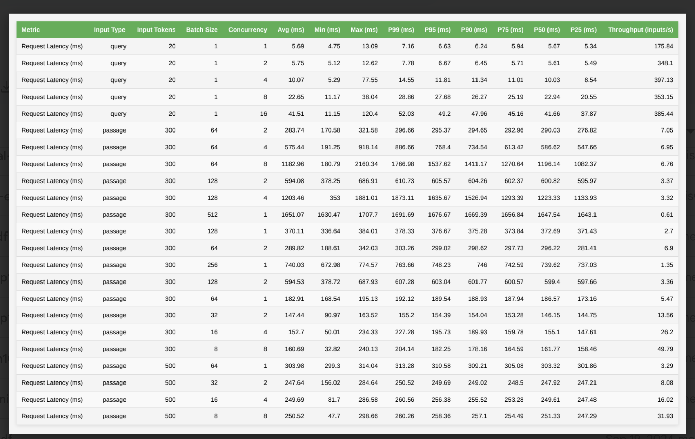
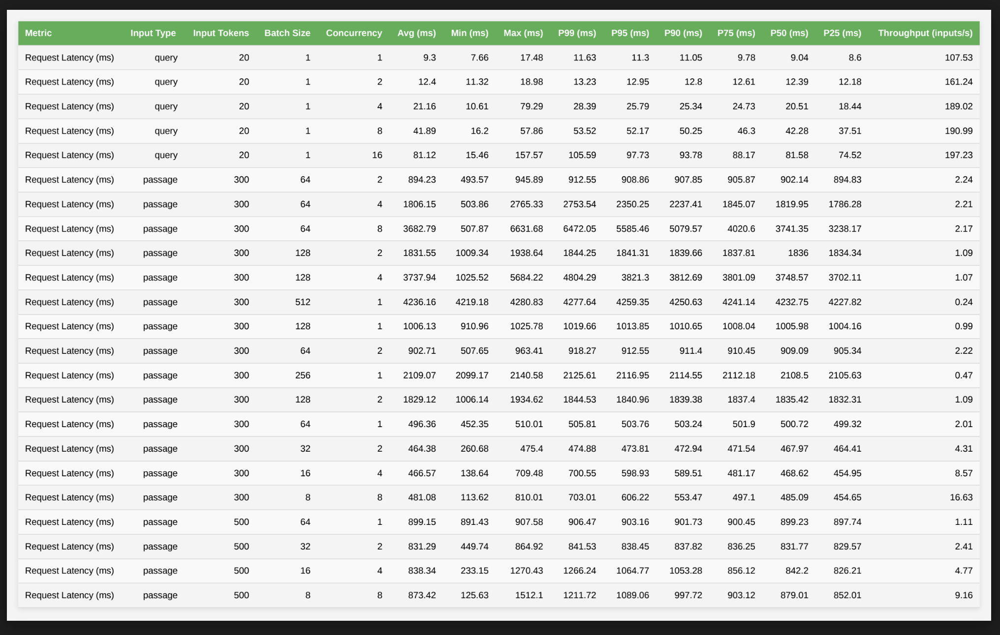
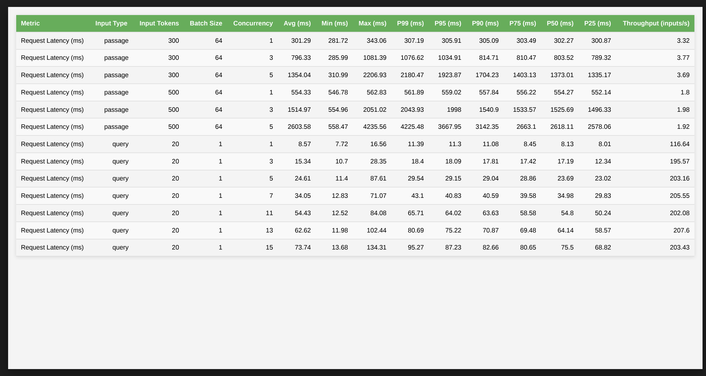

Nvidia-Triton
This repository provides scripts and examples to facilitate model export to ONNX format for use with ONNX Runtime. It also includes tools for running benchmarks on Nvidia Triton Inference Server. The repository includes example client code, benchmark results, and reports for testing on Nvidia A30 GPUs.

Reports:

Results:

e5-multilingual-base   

e5-large 

e5-large-mixed

e5-large-fp16

 

